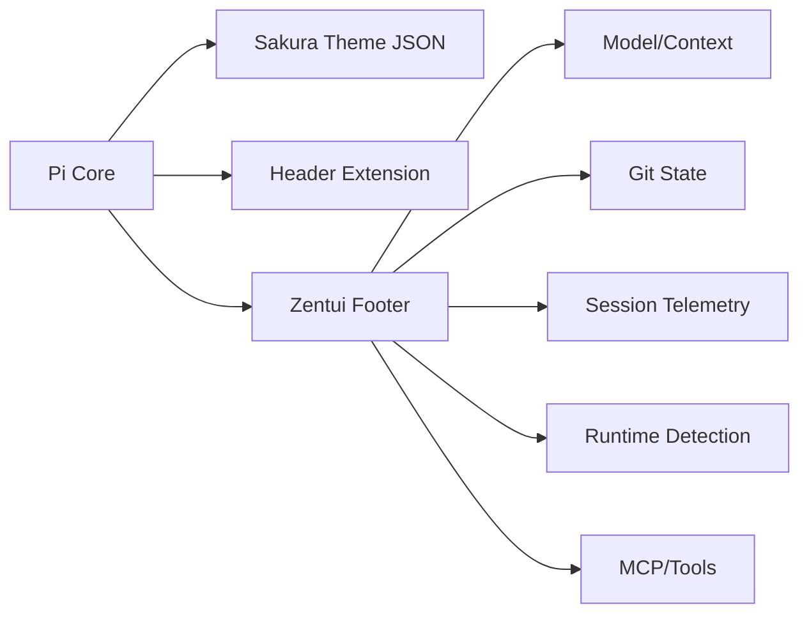

<div align="center">

# 🌸 Rinco's Sakura CyberDeck

**Personal Pi extension pack: Sakura Macaron theme + dynamic Zentui footer + cyberdeck header**

[](LICENSE)
[](https://github.com/earendil-works/pi)


**[Install](#-install)** · **[What's Included](#-whats-included)** · **[Docs](docs/README.md)** · **[Config](docs/configuration.md)**

English | [简体中文](README.zh-CN.md)

</div>

---

## 🎨 What's Included

This is my personal integration of several upstream Pi extensions into one cohesive package:

### 1. Sakura Macaron Theme

Dark truecolor theme with a pastel palette:

- **Sakura pink** (`#F2A7C6`) for accents and headings
- **Sky blue** (`#9FD3F2`) for links and function names
- **Lavender** (`#C7B8F5`) for types and variables
- **Mint green** (`#AEE5C5`) for strings and success states
- **Peach** (`#F6BC9A`) for inline code
- Deep purple backgrounds (`#14111A` → `#2D2438`) for comfortable long sessions

See the full palette in [`themes/sakura-macaron.json`](themes/sakura-macaron.json).

### 2. Cyberdeck Startup Header

Gradient ASCII art header that renders on session start:

- Anime-style art with sakura → sky gradient
- "SAKURA CYBERDECK" label in lavender → peach gradient
- Auto-centers based on terminal width
- Non-intrusive: shows once at boot, then gets out of your way

### 3. Dynamic Zentui Footer

Fully integrated status bar that tracks:

| Category            | What It Shows                                         |
| ------------------- | ----------------------------------------------------- |
| **Model & Context** | Current model, tokens used/available, context %       |
| **Session**         | Duration, turn count, thinking level, cache stats     |
| **Git**             | Branch, commit hash, dirty/clean status, diff metrics |
| **Cost**            | Accumulated session cost reported by Pi               |
| **Runtime**         | Auto-detected: Node, Python, Go, Rust, and more       |
| **Tools**           | Tool calls, main-agent activity, MCP, extension count |
| **Model Limits**    | Codex weekly remaining % or Token Switch balance      |

All styled in Sakura palette. Fully customizable via template strings.

The MCP segment reads the adapter's public `mcp` status and supports both the current `MCP: 3 servers enabled (2 connected)` format and the legacy `MCP: 2/3 servers` format. Zentui normalizes either form to `⊕ connected/enabled` (for example, `⊕ 2/3`) without intercepting or replacing the adapter's status API.

---

## 📦 Install

### Requirements

- **Pi** ≥ 0.80 (extension API support)
- **Truecolor terminal** (24-bit color)
- **Nerd Font** (optional; recommended for icons, with an `ascii` fallback)
- **Codex CLI** (optional fallback for Codex usage tracking)
- **`TOKEN_SWITCH_API_KEY`** (required to show Token Switch balance)

### From GitHub

```bash
pi install git:github.com/Rinisnotarobot/rinco-pi-settings
```

### Enable the Theme

The package manifest registers the header, footer, and theme automatically. After installation:

1. Restart Pi.
2. Open `/settings`.
3. Select **sakura-macaron** as the theme.

> Pi packages run with your user permissions. Review third-party extension source before installing it.

---

## ⚙️ Configuration

### Footer Settings

Run `/zentui` to open the interactive settings UI. It controls footer coloring, feature switches, layout, built-in segments, and third-party extension status placement. Changes are applied immediately and saved to `~/.pi/agent/sakura-cyberdeck-zentui.json`.

Useful direct commands:

```text
/zentui statusline enable
/zentui statusline disable
/zentui statusline toggle
/zentui format clear
```

### Optional Thinking Effort Selector

The `/effort` command is no longer bundled with this package. It has moved to the standalone [`rinco-pi-effort`](https://github.com/Rinisnotarobot/rinco-pi-effort) extension:

```bash
pi install git:github.com/Rinisnotarobot/rinco-pi-effort
```

The Zentui footer continues to display Pi's current thinking level when the `thinking` segment is enabled.

### Footer Templates

Custom footer formats use `$name` or `${name}` variables:

| Variable            | Description          | Example                    |
| ------------------- | -------------------- | -------------------------- |
| `$model`            | Provider and model   | `openai-codex/gpt-5.3`     |
| `$context`          | Context usage        | `35%/200k`                 |
| `$tokens`           | Token totals         | `↑ 4.2k ↓ 1.1k`            |
| `$cost`             | Session cost         | `$ 0.030`                  |
| `$session_duration` | Session time         | `14m 32s`                  |
| `$git_branch`       | Git branch           | `main`                     |
| `$git_commit`       | Short commit and tag | `a3f7b2c`                  |
| `$tool_counts`      | Completed tool calls | `read × 3 edit`            |
| `$mcp`              | MCP server status    | `⊕ 2/2`                    |

`$mcp` is empty when no recognized public `mcp` status is available. In the current enabled-server format, an omitted connected count is treated as zero; optional disabled-server details are accepted but are not included in the compact footer label.

**Example footer format:**

```text
/zentui format "$model · $context · $cost · $git_branch( $git_commit) · $session_duration"
```

To restore the built-in three-line layout, run `/zentui format clear`.

Full reference: [Footer Guide](docs/footer.md) · [Configuration Docs](docs/configuration.md)

---

## 📚 Documentation

| Doc                                            | What's Inside                            |
| ---------------------------------------------- | ---------------------------------------- |
| **[Getting Started](docs/getting-started.md)** | Installation, first steps, common setups |
| **[Footer Guide](docs/footer.md)**             | Template variables, formatting, examples |
| **[Configuration](docs/configuration.md)**     | All settings, defaults, overrides        |
| **[Architecture](docs/architecture.md)**       | How it works under the hood              |
| **[Theme & Header](docs/theme-and-header.md)** | Color palette, header customization      |
| **[Development](docs/development.md)**         | Contributing, building, releasing        |
| **[Troubleshooting](docs/troubleshooting.md)** | Common issues, fixes, FAQs               |

Detailed Chinese documentation: [**docs/README.md**](docs/README.md)

---

## 🏗️ How It Works



**Design principles:**

- Uses only Pi and TUI APIs (no external dependencies)
- Non-invasive: doesn't replace editor, keymap, or core UX
- Composable: works alongside extensions that do not replace the same header or footer surfaces
- Async updates: no blocking on I/O

---

## 🛠️ Development

This is a personal package, but PRs are welcome for:

- Footer metrics or layout improvements
- Theme palette tweaks
- Bug fixes

**Before submitting:**

1. `npm test` — tests must pass
2. `npm run check` — validate package structure and source invariants
3. Update docs if adding features

See [Development Guide](docs/development.md).

---

## 🙏 Attribution

This package integrates and adapts work from:

- [`beautifulrem/pi-sakura-cyberdeck`](https://github.com/beautifulrem/pi-sakura-cyberdeck)
- [`lmilojevicc/pi-zentui`](https://github.com/lmilojevicc/pi-zentui)
- [`RealAlexandreAI/pi-shannon-statusline`](https://github.com/RealAlexandreAI/pi-shannon-statusline)
- [`narumiruna/pi-extensions` (`pi-codex-usage`)](https://github.com/narumiruna/pi-extensions)

All upstream projects are MIT licensed. Original notices preserved in [`NOTICE`](NOTICE) and [`licenses/`](licenses).

Thank you to every original author.

---

## 💬 Troubleshooting

| Issue               | Fix                                                 |
| ------------------- | --------------------------------------------------- |
| Icons show as `?`   | Install a Nerd Font and configure your terminal     |
| Colors look wrong   | Enable truecolor in your terminal settings          |
| Footer not updating | Check Pi version (`pi --version`) — requires ≥ 0.80 |

Full troubleshooting guide: [docs/troubleshooting.md](docs/troubleshooting.md)

**Issues?** [github.com/Rinisnotarobot/rinco-pi-settings/issues](https://github.com/Rinisnotarobot/rinco-pi-settings/issues)

---

## 📝 License

[MIT](LICENSE)
