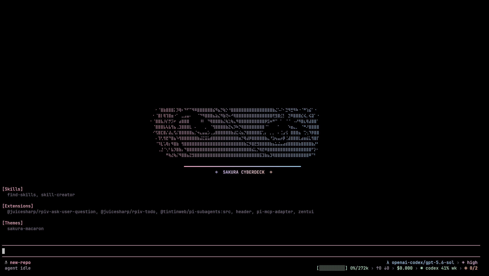
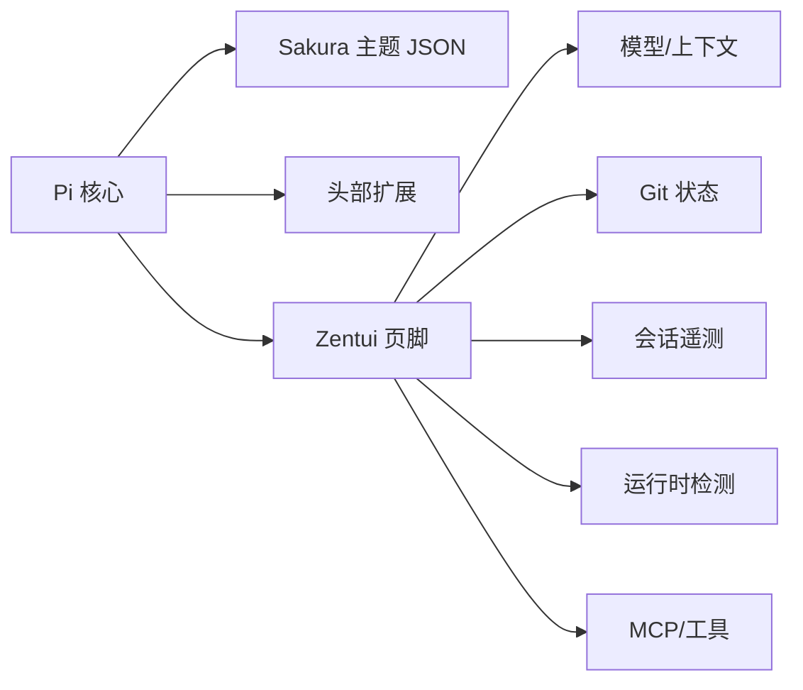

<div align="center">

# 🌸 Rinco's Sakura CyberDeck

**个人 Pi 扩展包：Sakura Macaron 主题 + 动态 Zentui 页脚 + 赛博甲板启动头**

[](LICENSE)
[](https://github.com/earendil-works/pi)



**[安装](#-安装)** · **[包含内容](#-包含内容)** · **[文档](docs/README.md)** · **[配置](docs/configuration.md)**

[English](README.md) | 简体中文

</div>

---

## 🎨 包含内容

这是我将多个上游 Pi 扩展整合成一个统一包的个人集成：

### 1. Sakura Macaron 主题

深色真彩主题，马卡龙色板：

- **樱花粉** (`#F2A7C6`) 用于强调和标题
- **天空蓝** (`#9FD3F2`) 用于链接和函数名
- **薰衣草紫** (`#C7B8F5`) 用于类型和变量
- **薄荷绿** (`#AEE5C5`) 用于字符串和成功状态
- **蜜桃橙** (`#F6BC9A`) 用于行内代码
- 深紫色背景 (`#14111A` → `#2D2438`) 适合长时间编码

完整色板见 [`themes/sakura-macaron.json`](themes/sakura-macaron.json)。

### 2. 赛博甲板启动头

会话启动时渲染的渐变 ASCII 艺术头：

- 动漫风格艺术，樱花粉 → 天空蓝渐变
- "SAKURA CYBERDECK" 标签，薰衣草紫 → 蜜桃橙渐变
- 根据终端宽度自动居中
- 非侵入式：启动时显示一次，然后不挡路

### 3. 动态 Zentui 页脚

功能完整的状态栏，追踪：

| 类别             | 显示内容                                 |
| ---------------- | ---------------------------------------- |
| **模型与上下文** | 当前模型、已用/可用 token、上下文百分比  |
| **会话**         | 持续时长、轮次计数、思考等级、缓存统计   |
| **Git**          | 分支、提交哈希、脏/干净状态、差异指标    |
| **成本**         | Pi 报告的累计会话成本                    |
| **运行时**       | 自动检测：Node、Python、Go、Rust 等      |
| **工具**         | Tool 调用、主 Agent 活动、MCP、扩展计数  |
| **模型额度**     | Codex 周限额剩余百分比或 Token Switch 余额 |

所有内容采用 Sakura 色板样式。通过模板字符串完全可定制。

MCP 状态段读取适配器公开的 `mcp` 状态，同时兼容当前格式 `MCP: 3 servers enabled (2 connected)` 与旧格式 `MCP: 2/3 servers`。Zentui 会将两者统一显示为 `⊕ 已连接数/已启用数`（例如 `⊕ 2/3`），不会拦截或替换适配器的状态 API。

### 4. Thinking Effort 选择器

运行 `/effort` 可打开居中且自适应宽度的选择器，在 Pi 的七档思考等级间切换：

```text
off → minimal → low → medium → high → xhigh → max
```

选择器会定位到当前思考等级，遵循 Pi 已配置的确认/取消键位，并通过 Pi 原生 Thinking Level API 应用结果。未选择模型或当前模型不支持推理时，会显示明确警告。

---

## 📦 安装

### 前置要求

- **Pi** ≥ 0.80（扩展 API 支持）
- **真彩终端**（24 位色）
- **Nerd Font**（可选；建议用于图标，也可切换到 `ascii` 模式）
- **Codex CLI**（可选，作为 Codex 用量查询 fallback）
- **`TOKEN_SWITCH_API_KEY`**（显示 Token Switch 余额时必需）

### 从 GitHub 安装

```bash
pi install git:github.com/Rinisnotarobot/rinco-pi-settings
```

### 启用主题

包清单会自动注册 Header、Footer 和主题。安装完成后：

1. 重启 Pi；
2. 打开 `/settings`；
3. 选择 **sakura-macaron** 主题。

> Pi 包以当前用户权限运行。安装第三方扩展前，请先审查其源码。

---

## ⚙️ 配置

### Footer 设置

运行 `/zentui` 可打开交互式设置界面，用于调整 Footer 配色、功能开关、布局、内置状态段以及第三方扩展状态的位置。修改会立即生效，并保存到 `~/.pi/agent/sakura-cyberdeck-zentui.json`。

常用直接命令：

```text
/zentui statusline enable
/zentui statusline disable
/zentui statusline toggle
/zentui format clear
```

### Thinking Effort

在 Pi TUI 中选好支持推理的模型后运行 `/effort`。弹窗会从 Pi 当前思考等级开始，并支持以下操作：

| 按键                      | 操作                         |
| ------------------------- | ---------------------------- |
| `Left` / `Right`          | 向前或向后移动一档           |
| `Home` / `End`            | 跳至 `off` / `max`           |
| 已配置的确认键或 `Space`  | 应用高亮等级                 |
| 已配置的取消键            | 关闭弹窗且不修改思考等级     |

选择器始终展示 Pi 的全部七档等级，但实际可用等级取决于当前模型和 Provider。确认后会提示最终应用的等级；如果 Pi 对请求进行了归一化，提示中会同时显示请求值和实际值。Footer 的 Thinking 状态段随后通过 Pi 原生 `thinking_level_select` 事件更新。

### Footer 模板

自定义 Footer 格式使用 `$name` 或 `${name}` 变量：

| 变量                | 描述                 | 示例                       |
| ------------------- | -------------------- | -------------------------- |
| `$model`            | Provider 和模型      | `openai-codex/gpt-5.3`     |
| `$context`          | Context 使用情况     | `35%/200k`                 |
| `$tokens`           | Token 汇总           | `↑ 4.2k ↓ 1.1k`            |
| `$cost`             | 会话成本             | `$ 0.030`                  |
| `$session_duration` | 会话时长             | `14m 32s`                  |
| `$git_branch`       | Git 分支             | `main`                     |
| `$git_commit`       | 短提交哈希和 Tag     | `a3f7b2c`                  |
| `$tool_counts`      | 已完成的 Tool 调用   | `read × 3 edit`            |
| `$mcp`              | MCP Server 状态      | `⊕ 2/2`                    |

没有可识别的公开 `mcp` 状态时，`$mcp` 为空。对于当前的 enabled-server 格式，若未提供 connected 数量则按 0 处理；可选的 disabled 数量会被接受，但不会出现在紧凑 Footer 标签中。

**Footer 格式示例：**

```text
/zentui format "$model · $context · $cost · $git_branch( $git_commit) · $session_duration"
```

运行 `/zentui format clear` 可恢复内置三行布局。

完整参考：[页脚指南](docs/footer.md) · [配置文档](docs/configuration.md)

---

## 📚 文档

| 文档                                       | 内容                     |
| ------------------------------------------ | ------------------------ |
| **[快速开始](docs/getting-started.md)**    | 安装、首次设置、常见配置 |
| **[页脚指南](docs/footer.md)**             | 模板变量、格式化、示例   |
| **[配置参考](docs/configuration.md)**      | 所有设置、默认值、覆盖   |
| **[架构说明](docs/architecture.md)**       | 底层工作原理             |
| **[主题与头部](docs/theme-and-header.md)** | 调色板、头部自定义       |
| **[开发指南](docs/development.md)**        | 贡献、构建、发布         |
| **[故障排查](docs/troubleshooting.md)**    | 常见问题、修复、FAQ      |

详细中文文档：[**docs/README.md**](docs/README.md)

---

## 🏗️ 工作原理



**设计原则：**

- 仅使用 Pi 和 TUI API（无外部依赖）
- 非侵入式：不替换编辑器、键位映射或核心 UX
- 可组合：可与不替换同一 Header 或 Footer 区域的扩展并存
- 异步更新：I/O 不阻塞

---

## 🛠️ 开发

这是个人包，但欢迎针对以下内容的 PR：

- 页脚指标或布局改进
- 主题调色板调整
- Bug 修复

**提交前：**

1. `npm test` — 测试必须通过
2. `npm run check` — 校验包结构与源码约束
3. 添加功能时更新文档

参见[开发指南](docs/development.md)。

---

## 🙏 归属

本包整合并改编了以下项目的工作：

- [`beautifulrem/pi-sakura-cyberdeck`](https://github.com/beautifulrem/pi-sakura-cyberdeck)
- [`lmilojevicc/pi-zentui`](https://github.com/lmilojevicc/pi-zentui)
- [`RealAlexandreAI/pi-shannon-statusline`](https://github.com/RealAlexandreAI/pi-shannon-statusline)
- [`narumiruna/pi-extensions`（`pi-codex-usage`）](https://github.com/narumiruna/pi-extensions)

所有上游项目均为 MIT 许可。原始声明保存在 [`NOTICE`](NOTICE) 和 [`licenses/`](licenses)。

感谢每一位原作者。

---

## 💬 故障排查

| 问题           | 解决方法                                    |
| -------------- | ------------------------------------------- |
| 图标显示为 `?` | 安装 Nerd Font 并在终端中配置               |
| 颜色显示错误   | 在终端设置中启用真彩色                      |
| 页脚不更新     | 检查 Pi 版本（`pi --version`）— 需要 ≥ 0.80 |

完整故障排查指南：[docs/troubleshooting.md](docs/troubleshooting.md)

**遇到问题？** [github.com/Rinisnotarobot/rinco-pi-settings/issues](https://github.com/Rinisnotarobot/rinco-pi-settings/issues)

---

## 📝 许可

[MIT](LICENSE)
